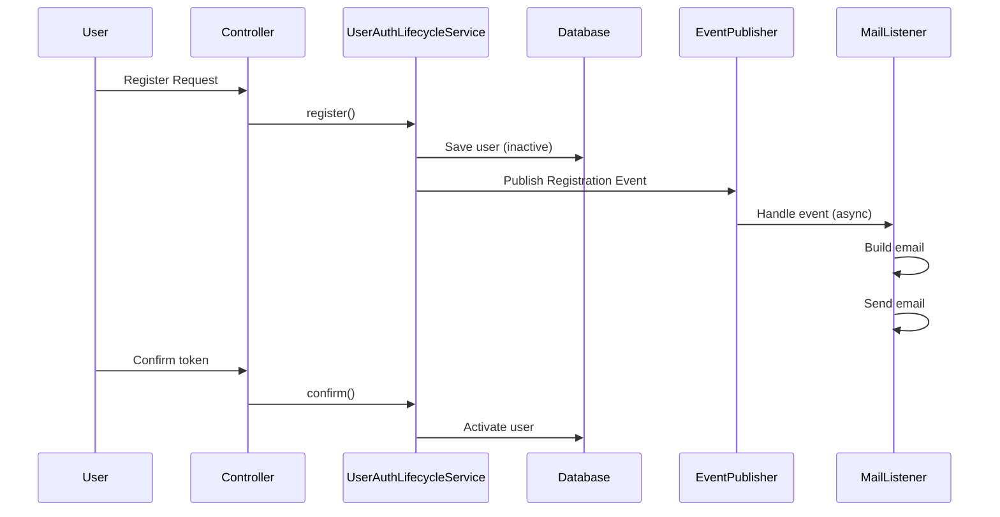

# Authentication Flow

```
           Register
              ↓
Inactive user + verification token
              ↓
       Verification email
              ↓
            Verify
              ↓
   Atomic token consumption
              ↓
         Activate user
    
```

```
 User requests password reset
             ↓
        Generate token
             ↓
       Store token (DB)
             ↓
   Send email (event-driven)
             ↓
      User clicks link
             ↓
       Validate token
             ↓
    Consume token (atomic)
             ↓
       Update password
```

