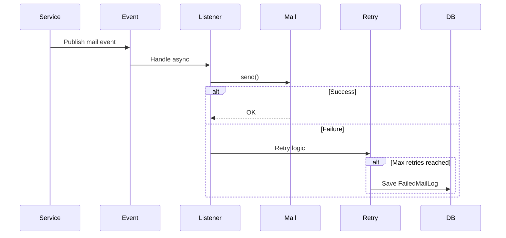

# Mail System

## Overview

The mail system is asynchronous and resilient.

It supports:

- Notifications
- Bulk messaging
- Retry mechanism
- Dead-letter logging

---  

## Flow

```
Business Action (e.g. registration)
        ↓
Publish Mail Event
        ↓
Async Listener (@Retryable)
        ↓
MailTemplateService
        ↓
MailService (SMTP)
        ↓
Success → Done
Failure → Retry → Recover → FailedMailLog
```



## Retry Strategy

- Automatic retries

- Backoff strategy

- Final fallback: Dead-Letter table

----------

## Why this design?

- Prevents blocking main flow

- Improves resilience

- Enables monitoring of failures

---

## Processing Strategies

The system uses two different strategies depending on the use case:

### Per-booking (Reminders)

- One email per booking
- Used for time-sensitive notifications

### Per-user aggregation (Admin notifications)

- One email per user
- Aggregates:
    - overdue books
    - unpaid fines
    - heavy usage

This reduces email noise and improves readability.