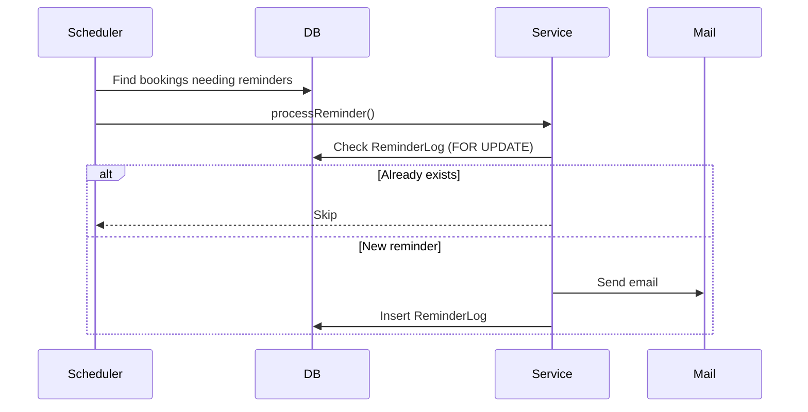

# Reminder System

## Overview

The reminder system ensures users are notified about due or overdue books.

It is:

- Scheduled
- Event-driven
- Best-effort idempotent

---  

## Flow

```
            Scheduler
               ↓
     BookingReminderService
               ↓
 Publish BookingReminderEvent
               ↓
  Async Listener (@Retryable)
               ↓
ReminderProcessingService (REQUIRES_NEW)
               ↓
[1] SELECT ... FOR UPDATE (idempotency check)
               ↓
        [2] If exists → STOP
               ↓
        [3] Build Email
               ↓
        [4] Send Email
               ↓
     [5] Save Reminder Log
               └── Handle duplicate (DB constraint) 
                                  ↓  
                       If duplicate → catch & skip

```



## Key Features

- Pessimistic locking reduces concurrent duplicate processing
- Unique constraint prevents duplicate log entries
- Safe to retry due to transactional isolation
- `REQUIRES_NEW` transaction isolates processing

## Limitations

The current implementation provides **best-effort idempotency**.

In rare cases, duplicate emails may still occur:

- Concurrent execution before the reminder log is created
- Failure after email is sent but before the log is persisted

This is an intentional trade-off:

- Sending email before persisting the log ensures that notifications are not lost
- Accepts a small risk of duplicate delivery under failure or concurrency

## Future Improvements

- Reservation-based processing (`PENDING → SENT`)
- Outbox pattern for guaranteed delivery in distributed systems